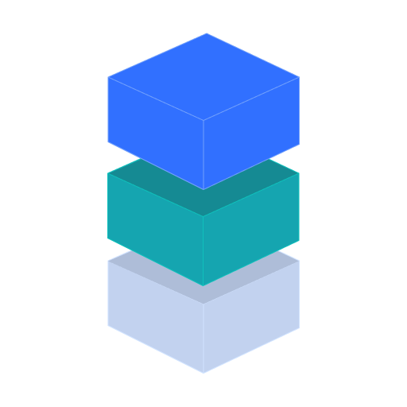

<!-- LOGO -->
<br />
<h1>
<p align="center">
  
  <br>Dexter Dashboard
</h1>
  <p align="center">
    Built for EthOnline 2021.
    <br />
    </p>
</p>
<p align="center">
  <a href="#about-the-project">About The Project</a> •
  <a href="#stack">Stack</a> •
  <a href="#creating-blocks">Creating Blocks</a> •
  <a href="#credits">Credits</a>

</p>


## About The Project
Dexter is a DeFi dashboard that allows you to create, import and export dashboard layouts to share with your friends. The dashboard aims to combine the customizability of Notion with the detailed data insights of Bloomberg terminal. Users have the ability to open a pull request to easily add their own blocks to the repository. Please see below for more information on creating your own block.


<p align="center">


</p>

## Stack

Name                          |  Usage
----------------------------------|------------------------------------------------------------------------------------
Alchemy            |  Primary Web3 API for fetching token metadata and balances.
The Graph            |  Provides on chain data for analytics and NFT source information.
Protocol Labs            |  NFT.Storage is used to upload images to IPFS and provide a ipfs url for NFT creation.
ENS                |  Reverse and forward ENS resolution on the wallet provides readable address information.
Zora                 |  Auction images are displayed on the NFT block
Scaffold Eth          |  The Next.js and Typescript template provided a great starter for this project.
Chakra UI                 |  For style


## Creating Blocks
- Step 1: Create your new block folder in the `/blocks` folder.

```
src
└── blocks
    └── YourAwesomeBlock.tsx
```
- Step 2: Write your component and wrap it in the `<CustomBlock/>` component.
```typescript
import React from 'react'
import { CustomBox } from '@components/CustomBox'
import {Text} from '@chakra-ui/layout'

export const AwesomeBlock = () => {
  return (
    <CustomBlock>
      <Text>My awesome DeFi block for Dexter</Text>
    </CustomBlock>
  )
}
```
- Step 3: Add the custom block to the `/BlockData` folder.
```
src
└── constants
    └── BlockData
```

In the `BlockData` array, add your component.
```typescript
const BlockData = [
  ...OtherData,
  { index: '12', title: 'AwesomeBlock', protocol: 'Etherum' },
]
```

In the `getBlockType` function, add your component to the switch statement.
```typescript
export const getBlockType = (block: BlockType, provided): JSX.Element => {
  switch (block.title) {
    case "AwesomeBlock":
      return <AwesomeBlock/>
  }
```


- Done 🎉

## Credits
- Created by Jack Burrus

[](https://github.com/jackburrus)
[](https://twitter.com/jackburrus)
[](https://www.linkedin.com/in/jamesburrus/)